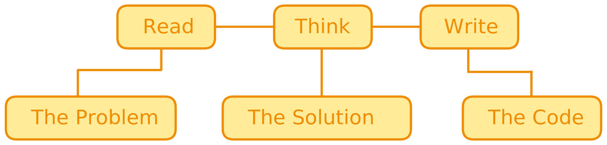

> _"Everybody should learn to program a computer because it teaches you how to think."_ **– Steve Jobs**

> _I taught myself how to program computers when I was a kid, bought my first computer when I was 10, and sold my first commercial program when I was 12._ **– Elon Musk**

> _Code is like humor. When you have to explain it, it’s bad._ **– Cory House**

